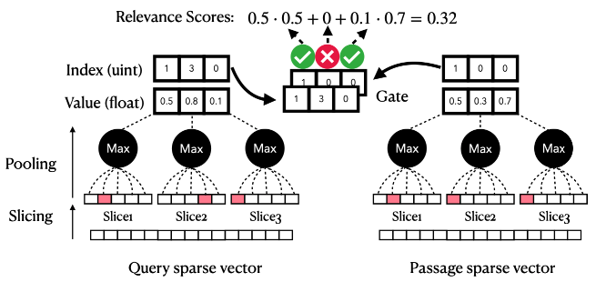

# Densifying Sparse Representations (DSRs)

[Sheng-Chieh Lin and Jimmy Lin - Densifying Sparse Representations for Passage Retrieval by Representational Slicing (arXiv 2021)](https://arxiv.org/abs/2112.04666)

## Others

- https://github.com/terrier-org/pyterrier